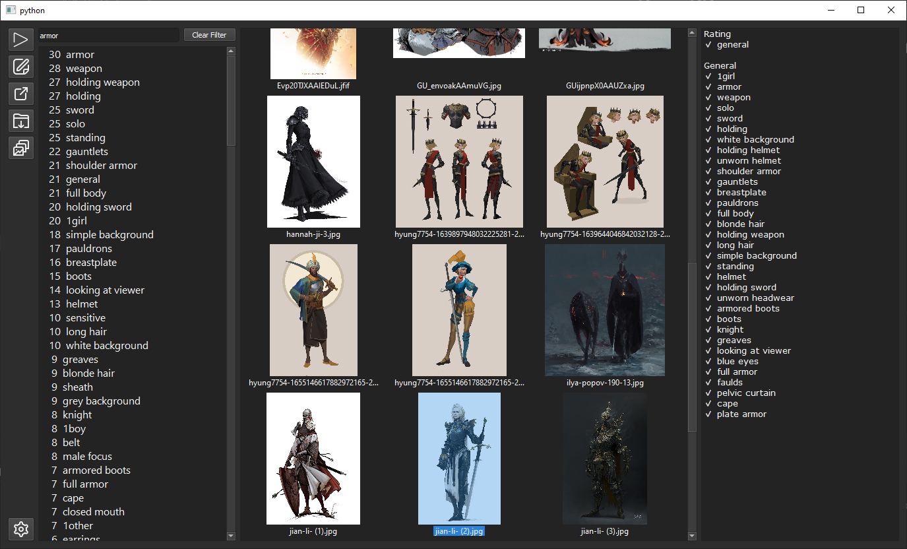

# Bulk AI Image Tagger

Version 2 of https://github.com/Vaedrenn/Bulk-AI-Image-Classification-Tool with support of WD models

## Installation and Running
### Prerequisites
+ Python 3.9 - 3.11
+ Windows 10/11
+ 6GB+ of RAM

Linux Troubleshooting: https://github.com/biolab/orange3/issues/5974#issuecomment-1134663073

## Models
Models are not included, must be downloaded seperately.
### Waifu Diffusion
Anime style image classification model. Best used for tagging digital art mediums but also preforms well enough for photos.
 
Download https://huggingface.co/SmilingWolf/wd-vit-tagger-v3

For other WD models see under models: https://huggingface.co/SmilingWolf 

## Features
+ Filterable image gallery
+ Bulk tagging
+ Editable Captions
+ JSON and TXT output
+ File sorting/moving